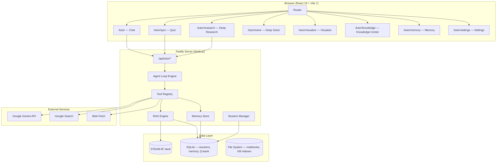

# Fad.Tutor — Native DeepTutor Built on the Fad.Wiki Stack

Build a full-featured AI tutoring workspace **inside** the existing Fad.Wiki codebase, reusing its tech stack (Vite 7 + React 19 + Fastify 5 + `@google/genai` + SQLite + Tailwind 4) and its STEAM-IE vault as the primary knowledge source. No Python, no separate process — one `npm start` runs everything.

## User Review Required

> [!IMPORTANT]
> **Gemini API Key handling** — Today the chatbot sends the user's key from `localStorage` on every request. For Fad.Tutor, where we add long-lived sessions, memory, and RAG, we should move the key to a server-side `.env` / runtime config so it's never sent over the wire. Confirm whether you want:
> - **(A) Server-side `.env`** — set `GEMINI_API_KEY` once, never touch it again.
> - **(B) Keep current browser-side key** — user pastes key in Settings, sent per-request (simpler, no .env needed).

> [!IMPORTANT]
> **Scope of Phase 1 vs later phases** — This plan is structured in 5 phases. Phase 1 (Core Agent Loop + Chat UI) is a self-contained, shippable milestone. Do you want us to build **all 5 phases** end-to-end, or deliver Phase 1 first, demo it, then proceed?

## Open Questions

> [!NOTE]
> **Which Gemini model?** — Currently you use `gemini-2.5-flash`. DeepTutor uses multiple models per capability. Should we default everything to `gemini-2.5-flash` for cost, or allow per-capability model selection in Settings (e.g. `gemini-2.5-pro` for Deep Research)?

> [!NOTE]
> **Embedding for RAG** — DeepTutor uses LlamaIndex vector + BM25. Our wiki already has SQLite FTS5 full-text search. For v1, should we:
> - **(A)** Reuse FTS5 only (zero new dependencies, already works).
> - **(B)** Add Gemini Embedding API (`text-embedding-004`) + a local vector store alongside FTS5 for hybrid retrieval.

---

## Architecture Overview



---

## Proposed Changes

The work is organized into **5 phases**, each shippable. Files are grouped by component.

---

### Phase 1 — Core Agent Loop + Chat UI

The foundation: a tool-calling agent loop with streaming, session persistence, and the primary chat surface. This replaces the current simple chatbot widget with a full-page tutor workspace.

---

#### Server: Agent Engine (`src/server/tutor/`)

##### [NEW] [agent-loop.ts](file:///c:/Users/Frehun/Documents/Fad.Lab/ai/Fad-wiki-os/wiki-os-main/src/server/tutor/agent-loop.ts)
The core agent loop. Implements the think → tool-call → observe → respond cycle using Gemini's function-calling API. Streams responses via Server-Sent Events (SSE). Key design:
- Accepts a `Capability` enum (chat, deep_solve, deep_question, deep_research, visualize, mastery_path)
- Each capability has a system prompt template and a tool whitelist
- Tool calls are executed server-side, results fed back into the loop
- Max rounds configurable (default 10) to prevent runaway loops
- `ask_user` tool pauses the loop and returns a structured question to the client

##### [NEW] [tool-registry.ts](file:///c:/Users/Frehun/Documents/Fad.Lab/ai/Fad-wiki-os/wiki-os-main/src/server/tutor/tool-registry.ts)
Central registry of all tools the agent can call. Each tool is a typed function with:
- `name`, `description`, `parameters` (JSON Schema for Gemini function declarations)
- `execute(params, context)` → `ToolResult`
- `capabilities: Capability[]` — which capabilities can use this tool

**Phase 1 built-in tools:**
| Tool | Description |
|:--|:--|
| `rag` | Search the STEAM-IE vault via existing wiki FTS5 + retrieve full page content |
| `web_search` | Google Search via Gemini's `googleSearch` grounding tool |
| `web_fetch` | Fetch and extract readable content from a URL (reuses existing `@mozilla/readability` + `jsdom`) |
| `reason` | Chain-of-thought scratchpad — model writes reasoning steps before answering |
| `brainstorm` | Generate multiple approaches/ideas before selecting one |
| `ask_user` | Pause the loop, send a structured question to the user |

##### [NEW] [tools/rag-tool.ts](file:///c:/Users/Frehun/Documents/Fad.Lab/ai/Fad-wiki-os/wiki-os-main/src/server/tutor/tools/rag-tool.ts)
Wraps the existing `searchWiki()` and `getWikiPage()` functions to provide vault-grounded retrieval. Searches FTS5, retrieves top-N pages, and returns markdown content with source citations.

##### [NEW] [tools/web-tools.ts](file:///c:/Users/Frehun/Documents/Fad.Lab/ai/Fad-wiki-os/wiki-os-main/src/server/tutor/tools/web-tools.ts)
`web_search` (Gemini grounding) and `web_fetch` (URL → readable markdown using existing `@mozilla/readability` + `jsdom` + `turndown`).

##### [NEW] [tools/thinking-tools.ts](file:///c:/Users/Frehun/Documents/Fad.Lab/ai/Fad-wiki-os/wiki-os-main/src/server/tutor/tools/thinking-tools.ts)
`reason` and `brainstorm` tools — structured thinking helpers.

##### [NEW] [session-manager.ts](file:///c:/Users/Frehun/Documents/Fad.Lab/ai/Fad-wiki-os/wiki-os-main/src/server/tutor/session-manager.ts)
SQLite-backed session persistence. Schema:
- `tutor_sessions` — id, title, capability, created_at, updated_at
- `tutor_messages` — id, session_id, role, content, tool_calls (JSON), tool_results (JSON), created_at
- Auto-titles sessions using a one-shot Gemini call after the first exchange

##### [NEW] [tutor-routes.ts](file:///c:/Users/Frehun/Documents/Fad.Lab/ai/Fad-wiki-os/wiki-os-main/src/server/tutor/tutor-routes.ts)
Fastify route plugin registering all `/api/tutor/*` endpoints:
- `POST /api/tutor/chat` — SSE streaming agent turn
- `GET /api/tutor/sessions` — list sessions
- `GET /api/tutor/sessions/:id` — get session with messages
- `DELETE /api/tutor/sessions/:id` — delete session
- `POST /api/tutor/sessions/:id/rename` — rename session

##### [NEW] [prompts.ts](file:///c:/Users/Frehun/Documents/Fad.Lab/ai/Fad-wiki-os/wiki-os-main/src/server/tutor/prompts.ts)
Externalized system prompts for each capability. Interpolates vault context, user memory, and persona into the prompt template.

#### [MODIFY] [app.ts](file:///c:/Users/Frehun/Documents/Fad.Lab/ai/Fad-wiki-os/wiki-os-main/src/server/app.ts)
Register the new tutor routes plugin: `app.register(tutorRoutes, { prefix: '/api/tutor' })`.

---

#### Client: Chat Surface (`src/client/routes/tutor/`)

##### [NEW] [tutor-layout.tsx](file:///c:/Users/Frehun/Documents/Fad.Lab/ai/Fad-wiki-os/wiki-os-main/src/client/routes/tutor/tutor-layout.tsx)
Full-page layout with a collapsible sidebar (session list, capability selector, KB selector) and main chat/content pane. Matches DeepTutor's connected-surface design.

##### [NEW] [chat-view.tsx](file:///c:/Users/Frehun/Documents/Fad.Lab/ai/Fad-wiki-os/wiki-os-main/src/client/routes/tutor/chat-view.tsx)
The primary chat interface:
- SSE streaming with real-time token rendering
- Tool-call activity panel (collapsible, shows what the agent is doing)
- Markdown rendering with LaTeX (KaTeX), code highlighting, and Mermaid diagrams
- Capability switcher in the composer toolbar (Chat, Quiz, Research, Solve, Visualize)
- `ask_user` response UI — structured questions the user can answer inline
- File attachment support (drag-and-drop, uploads stored in `data/tutor/attachments/`)

##### [NEW] [session-sidebar.tsx](file:///c:/Users/Frehun/Documents/Fad.Lab/ai/Fad-wiki-os/wiki-os-main/src/client/routes/tutor/session-sidebar.tsx)
Session history list with search, rename, and delete. Grouped by date (Today, Yesterday, Last 7 Days, Older).

##### [NEW] [composer.tsx](file:///c:/Users/Frehun/Documents/Fad.Lab/ai/Fad-wiki-os/wiki-os-main/src/client/routes/tutor/composer.tsx)
Rich input composer with:
- Capability chip selector
- KB selector chip (choose which knowledge bases to ground against)
- Attachment button
- Stop/regenerate controls during streaming

##### [NEW] [tool-activity.tsx](file:///c:/Users/Frehun/Documents/Fad.Lab/ai/Fad-wiki-os/wiki-os-main/src/client/routes/tutor/tool-activity.tsx)
Collapsible panel showing agent tool calls in real-time (searching vault, fetching web, reasoning…).

#### [MODIFY] [router.tsx](file:///c:/Users/Frehun/Documents/Fad.Lab/ai/Fad-wiki-os/wiki-os-main/src/client/router.tsx)
Replace the iframe-based `/tutor` route with the new native tutor layout. Add sub-routes for `/tutor/quiz`, `/tutor/research`, etc.

#### [DELETE] [tutor-route.tsx](file:///c:/Users/Frehun/Documents/Fad.Lab/ai/Fad-wiki-os/wiki-os-main/src/client/routes/tutor-route.tsx)
Remove the old iframe wrapper — we're going native.

---

### Phase 2 — Capabilities: Quiz, Solve, Research, Visualize

Extend the agent loop with specialized capability modes. Each mode is a different system prompt + tool configuration — no separate engines.

---

##### [NEW] [tools/quiz-tools.ts](file:///c:/Users/Frehun/Documents/Fad.Lab/ai/Fad-wiki-os/wiki-os-main/src/server/tutor/tools/quiz-tools.ts)
- `generate_questions` — produces MCQ, true/false, short-answer, fill-in-the-blank from vault content
- `grade_answer` — evaluates user's answer against reference, with detailed explanation
- `save_to_question_bank` — persists questions to SQLite `tutor_question_bank` table

##### [NEW] [tools/research-tools.ts](file:///c:/Users/Frehun/Documents/Fad.Lab/ai/Fad-wiki-os/wiki-os-main/src/server/tutor/tools/research-tools.ts)
- `deep_research` — multi-step research: outline → parallel web searches → synthesis → cited report
- `save_report` — saves the final report as a markdown file in the vault or as a notebook entry

##### [NEW] [tools/visualize-tools.ts](file:///c:/Users/Frehun/Documents/Fad.Lab/ai/Fad-wiki-os/wiki-os-main/src/server/tutor/tools/visualize-tools.ts)
- `create_chart` — generates Chart.js config JSON, rendered client-side
- `create_diagram` — generates Mermaid diagram code
- `create_interactive` — generates self-contained HTML widget (e.g., interactive quiz, timeline)

##### [NEW] [quiz-view.tsx](file:///c:/Users/Frehun/Documents/Fad.Lab/ai/Fad-wiki-os/wiki-os-main/src/client/routes/tutor/quiz-view.tsx)
Interactive quiz interface: card-based question display, answer input, grading feedback, question bank browser.

##### [NEW] [research-view.tsx](file:///c:/Users/Frehun/Documents/Fad.Lab/ai/Fad-wiki-os/wiki-os-main/src/client/routes/tutor/research-view.tsx)
Research report viewer: progress indicator during multi-step research, cited report rendering, save-to-vault button.

##### [NEW] [visualize-view.tsx](file:///c:/Users/Frehun/Documents/Fad.Lab/ai/Fad-wiki-os/wiki-os-main/src/client/routes/tutor/visualize-view.tsx)
Visualization renderer: Chart.js charts, Mermaid diagrams, sandboxed HTML widgets.

---

### Phase 3 — Knowledge Center + RAG Engine

Multi-engine knowledge management. Upgrade from simple FTS5 to a proper RAG pipeline.

---

##### [NEW] [rag-engine.ts](file:///c:/Users/Frehun/Documents/Fad.Lab/ai/Fad-wiki-os/wiki-os-main/src/server/tutor/rag-engine.ts)
Hybrid retrieval engine:
- **FTS5** (existing) — keyword/BM25 search across vault pages
- **Gemini Embedding** (new, optional) — `text-embedding-004` embeddings stored in SQLite with cosine similarity
- **Vault-aware chunking** — respects markdown headers, frontmatter, and wiki links
- Reciprocal Rank Fusion to merge FTS5 + vector results

##### [NEW] [knowledge-manager.ts](file:///c:/Users/Frehun/Documents/Fad.Lab/ai/Fad-wiki-os/wiki-os-main/src/server/tutor/knowledge-manager.ts)
Manages knowledge bases:
- Default KB: the connected STEAM-IE vault (auto-indexed)
- User can create additional KBs from uploaded documents (PDF, DOCX, TXT) parsed with built-in extractors
- KBs stored under `data/tutor/kb/<kb-id>/`

##### [NEW] [knowledge-view.tsx](file:///c:/Users/Frehun/Documents/Fad.Lab/ai/Fad-wiki-os/wiki-os-main/src/client/routes/tutor/knowledge-view.tsx)
Knowledge Center UI: list KBs, upload documents, view indexed documents, search within a KB.

---

### Phase 4 — Memory + Personalization

Three-layer memory system inspired by DeepTutor's L1/L2/L3 architecture, adapted for file + SQLite storage.

---

##### [NEW] [memory-store.ts](file:///c:/Users/Frehun/Documents/Fad.Lab/ai/Fad-wiki-os/wiki-os-main/src/server/tutor/memory-store.ts)
- **L1 — Traces**: Append-only JSONL event log per surface (chat, quiz, research). Raw interaction traces.
- **L2 — Curated Facts**: Per-surface markdown summaries extracted by the agent (`write_memory` tool). E.g., "User is studying thermodynamics, prefers visual explanations."
- **L3 — Synthesis**: Cross-surface profile synthesized periodically (learner profile, preferences, scope, progress).
- All stored under `data/tutor/memory/` — plain files you can read and edit.

##### [NEW] [tools/memory-tools.ts](file:///c:/Users/Frehun/Documents/Fad.Lab/ai/Fad-wiki-os/wiki-os-main/src/server/tutor/tools/memory-tools.ts)
- `read_memory` — retrieves relevant L2/L3 facts for the current turn
- `write_memory` — agent records a new fact/preference about the user
- Memory is automatically injected into system prompts when available

##### [NEW] [memory-view.tsx](file:///c:/Users/Frehun/Documents/Fad.Lab/ai/Fad-wiki-os/wiki-os-main/src/client/routes/tutor/memory-view.tsx)
Memory inspector: L1/L2/L3 tabs, editable L2 facts, memory graph visualization (reusing existing Sigma.js from the wiki graph).

##### [NEW] [personas.ts](file:///c:/Users/Frehun/Documents/Fad.Lab/ai/Fad-wiki-os/wiki-os-main/src/server/tutor/personas.ts)
Persona presets (Tutor, Peer, Research Assistant, Socratic Coach). Each is a markdown file under `data/tutor/personas/` that injects behavior instructions into the system prompt.

---

### Phase 5 — Co-Writer + Notebook + Settings

Complete the workspace with collaborative writing, persistent notebooks, and a settings control plane.

---

##### [NEW] [tools/notebook-tools.ts](file:///c:/Users/Frehun/Documents/Fad.Lab/ai/Fad-wiki-os/wiki-os-main/src/server/tutor/tools/notebook-tools.ts)
- `list_notebook` — list saved notebook entries
- `write_note` — save a note (from chat, quiz result, research report) to a notebook
- Notebooks stored as markdown files under `data/tutor/notebooks/`

##### [NEW] [notebook-view.tsx](file:///c:/Users/Frehun/Documents/Fad.Lab/ai/Fad-wiki-os/wiki-os-main/src/client/routes/tutor/notebook-view.tsx)
Notebook browser: categorized notes, full-text search, export to vault.

##### [NEW] [cowriter-view.tsx](file:///c:/Users/Frehun/Documents/Fad.Lab/ai/Fad-wiki-os/wiki-os-main/src/client/routes/tutor/cowriter-view.tsx)
Split-view markdown editor with live preview. Selection-aware editing: select text → ask the agent to rewrite/expand/simplify. Changes shown as accept/reject diffs.

##### [NEW] [settings-view.tsx](file:///c:/Users/Frehun/Documents/Fad.Lab/ai/Fad-wiki-os/wiki-os-main/src/client/routes/tutor/settings-view.tsx)
Settings control plane:
- **Model** — select Gemini model, temperature, max tokens per capability
- **Knowledge** — manage KBs, set default KB, configure RAG parameters
- **Memory** — toggle memory, set consolidation budgets, clear memory
- **Personas** — create/edit persona presets
- **Appearance** — theme selection (inherit from wiki or tutor-specific)

##### [NEW] [tutor-settings.ts](file:///c:/Users/Frehun/Documents/Fad.Lab/ai/Fad-wiki-os/wiki-os-main/src/server/tutor/tutor-settings.ts)
Server-side settings manager. Reads/writes `data/tutor/settings.json`. Validates and merges with defaults.

---

## Data Directory Layout

```
data/
└── tutor/
    ├── settings.json              # Model, RAG, memory config
    ├── sessions/                  # SQLite DB for sessions + messages
    │   └── tutor.db
    ├── memory/
    │   ├── L1/                    # Raw JSONL traces per surface
    │   │   ├── chat/
    │   │   ├── quiz/
    │   │   └── research/
    │   ├── L2/                    # Per-surface curated facts (.md)
    │   │   ├── chat.md
    │   │   ├── quiz.md
    │   │   └── research.md
    │   └── L3/                    # Cross-surface synthesis (.md)
    │       ├── profile.md
    │       ├── preferences.md
    │       └── scope.md
    ├── kb/                        # Knowledge base indexes
    │   └── <kb-id>/
    ├── notebooks/                 # Saved notebook entries
    ├── personas/                  # Persona .md files
    ├── question-bank/             # Saved quiz questions
    └── attachments/               # Uploaded files
```

---

## Feature Mapping: DeepTutor → Fad.Tutor

| DeepTutor Feature | Fad.Tutor Equivalent | Phase |
|:--|:--|:--|
| Chat (agent loop + tools) | ✅ Same loop with Gemini function calling + SSE streaming | 1 |
| Tool system (rag, web_search, reason, brainstorm, ask_user) | ✅ Same tools, powered by Gemini + vault FTS5 + Readability | 1 |
| Session persistence | ✅ SQLite-backed sessions with auto-titling | 1 |
| Quiz / Question generation | ✅ Quiz capability + question bank | 2 |
| Deep Solve (worked reasoning) | ✅ Solve capability with chain-of-thought | 2 |
| Deep Research (cited reports) | ✅ Research capability with multi-step web research | 2 |
| Visualize (charts, diagrams, animations) | ✅ Chart.js + Mermaid + sandboxed HTML widgets | 2 |
| Knowledge Center (multi-engine RAG) | ✅ FTS5 + optional Gemini Embedding hybrid | 3 |
| Obsidian vault integration | ✅ Native — the STEAM-IE vault IS the default KB | 3 |
| Memory (L1/L2/L3) | ✅ File-backed 3-layer memory with graph visualization | 4 |
| Personas | ✅ Markdown-based persona presets | 4 |
| Co-Writer | ✅ Split-view editor with AI-assisted selection editing | 5 |
| Notebooks | ✅ Markdown notebooks with vault export | 5 |
| Settings control plane | ✅ Model, RAG, memory, persona, appearance settings | 5 |
| Partners / IM channels | ❌ Out of scope (requires IM SDKs, multi-user auth) | — |
| Book Engine | ❌ Out of scope for initial version | — |
| Multi-user auth | ❌ Out of scope (single-user like current wiki) | — |
| CLI | ❌ Out of scope (web-first) | — |
| MCP servers | ❌ Out of scope for v1 | — |

---

## Technology Decisions

| Concern | Decision | Rationale |
|:--|:--|:--|
| **LLM** | `@google/genai` (already installed) | Same SDK, zero new deps |
| **Streaming** | Server-Sent Events (SSE) | Simpler than WebSocket for unidirectional streaming; no new dependencies |
| **Database** | `better-sqlite3` (already installed) | Reuse wiki's SQLite for sessions, memory, question bank |
| **RAG** | Wiki FTS5 (phase 1) + optional Gemini embeddings (phase 3) | Start simple, upgrade incrementally |
| **Markdown rendering** | `react-markdown` + `remark-gfm` + `rehype-highlight` (already installed) | Add KaTeX plugin for math |
| **Charts** | Chart.js (new, lightweight dep) | Standard, well-supported |
| **Diagrams** | Mermaid (new, lightweight dep) | Standard, matches DeepTutor |
| **Graph viz** | `sigma` + `graphology` (already installed) | Reuse for memory graph |
| **Web scraping** | `@mozilla/readability` + `jsdom` + `turndown` (already installed) | Already used for web clipper |
| **File attachments** | Multer or Fastify multipart | Minimal new dep for file uploads |

---

## Verification Plan

### Automated Tests
```bash
npm run typecheck          # TypeScript compilation check
npm run test               # Vitest unit tests for agent loop, tools, session manager
npm run lint               # ESLint
```

New test files:
- `tests/tutor/agent-loop.test.ts` — tool call parsing, loop termination, max rounds
- `tests/tutor/session-manager.test.ts` — CRUD, auto-titling
- `tests/tutor/rag-tool.test.ts` — vault search integration
- `tests/tutor/memory-store.test.ts` — L1/L2/L3 read/write

### Manual Verification
- Start `npm run dev`, navigate to `/tutor`
- Send a chat message → verify SSE streaming renders token-by-token
- Verify tool activity panel shows vault search + web search calls
- Create quiz from vault content → verify MCQ rendering + grading
- Check session list persists across page refreshes
- Test deep research → verify multi-step progress + cited report
- Verify memory writes persist and are visible in memory view
